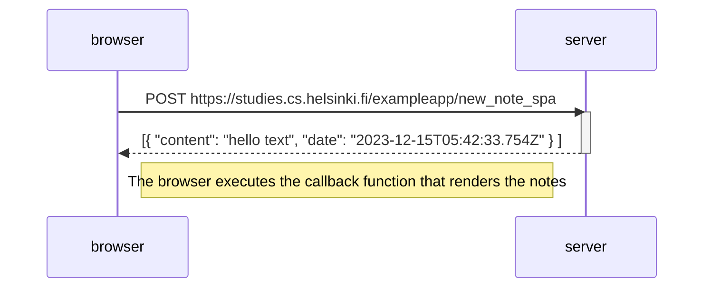

```mermaid
sequenceDiagram
    participant browser
    participant server

    browser->>server: POST https://studies.cs.helsinki.fi/exampleapp/new_note_spa
    activate server
    server-->>browser: [{ "content": "hello text", "date": "2023-12-15T05:42:33.754Z" } ]
    deactivate server

    Note right of browser: The browser executes the callback function that renders the notes
```
